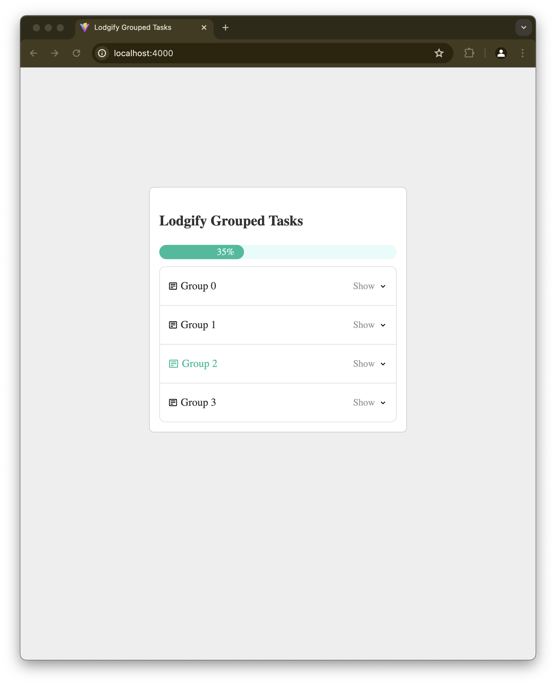
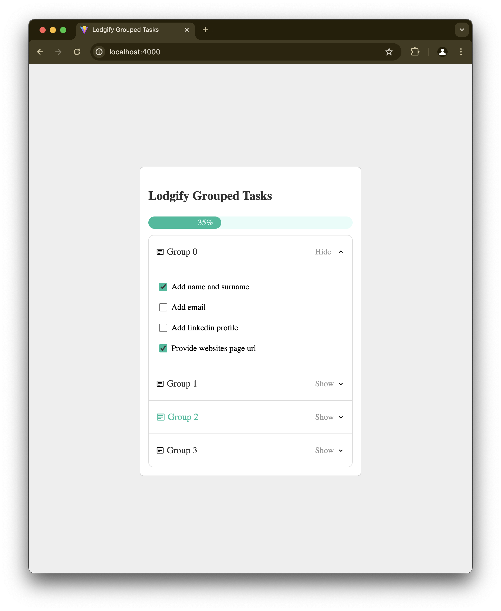
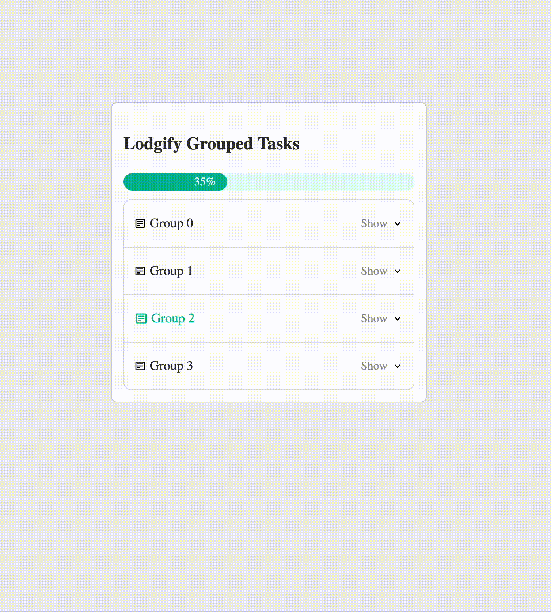

# Lodgify Grouped Tasks

Take home exercise for Lodgify. A widget to shows the current progress of the profile creation of an user. Basically an accordion which content are tasks are checkboxes. The user will be able to check and/or uncheck one of the tasks and see the progress bar change and if a group have all the checks it should be marked as green.

To start development server:

```
npm run dev
```

Next, open your browser and visit http://localhost:5173/. The default React project will be running on port 5173.

### Note:

    if running `antfu.vite` , vite server will start itself at port 4000.

## Tests

```
npm test:watch

```

or

```
npm test:watch <path-to-file>

```

# Notes

## General architecture and scaffolding

- Initial scaffolding is a repo of mine that I use for very small personal projects. [here](https://github.com/msrxse/default-scaffold-basic). Removed Tailwind to showcase CSS with `CSS-modules`.
- Very simple just all starts on `App.tsx` and in the components folder are 2 components: `Accordion` and `ProgressBar`. Other important file are in the hooks folder, hooks to retrieve data and to calculate progressBar output from fetched data and user actions.

## About state

- In term of state there are 2 approaches I could take and I did settle in one, regardless of performance and in a team setting this could have been something set to discuss.
  1- One approach could have been, to normalize all fetched data from API to also include the normalized sum of all values, and the specific normalize value of a task. And then the resulted data shape saved to local state, user actions would only mean to retrieve the normalized value of the task from the state itself, then to also access the total normalized value from the store. Finalizing with making sure you update the original stored data object itself.
  2- Second approach, and the one taken here, is: Instead save to local state fetched data as is. Then, we run actions to calculate initial normalized needed values. Then, as the user click tasks, call to update that state, we also need here to update the initial saved data.
  None is better than the other and a discussion could have been done to choose one approach over the other. Most probably reviewing performance and rerenders will help decide whats best.

## About accessibility

- Followed all not optional accessibility features for an accordion as stated in [w3.org/WAI/ARIA/apg/patterns/accordion](https://www.w3.org/WAI/ARIA/apg/patterns/accordion/).
- In terms of keyboard interactions:
  1- `Enter` and `Space` expands/collapses the focused accordion header
  2- `Tab` circles through all headers, `Shift` and `Tab` circles backwards
- In terms of `WAI-AIRA` roles:
  1- Accordion header has element with role=button
  2- Correct usage of `aria-expanded` set to the visibility of expanded content
  3- `Aria-control` of the header linked to the `id` of the expanded content
  4- `Id` of header linked to the `aria-labelledby` of the expanded content
  In addition to the accessibility measures described here, I currently use a static lint checker for accessibility rules on JSX elements. [That is eslint-plugin-jsx-a11y](https://www.npmjs.com/package/eslint-plugin-jsx-a11y)

## About testing

- I have not made many efforts to have tests in this repo because of time. However I have many examples of how to test different types of components under jest and the react-testing-library lib. For example:
- [Example tests on queries and getQueryData functions from react-query](https://github.com/msrxse/oneport-rates-ui/blob/main/src/hooks/rates.ts)
- [Example on tests that use Providers](https://github.com/msrxse/oneport-rates-ui/blob/main/src/hooks/rates.ts)
- [Example tests on components that themselves use hooks](https://github.com/msrxse/oneport-rates-ui/blob/main/src/components/rates/tests/RatesComponent.test.tsx)

## whats missing

- Some CSS mismatches. Eg. checkbox not correct styles. Missing correctly applying font globally to the project, instead given to tags here and there.
- Icons are not quite as in the designs
- Missing tests, I just didnt have time for any and instead focused on accessibility since it seemed more important
- Missing accessibility for checkboxes, also missing a good user-experience on those (user cant toggle checkbox from the keyboard)
- State management might not be ideal, would need a performance review on that. Looking at wasted rerenders and user experience in general
- Proper `empty states` and `error states` are not implemented
- Animations: There are no animations at the moment and with a little more time I could have apply them

## Images

| Closed accordion                                                 | Open accordion                                                   |
| ---------------------------------------------------------------- | ---------------------------------------------------------------- |
|  |  |

- Video shows `Tab` and `Shift + Tab` keyboard navigation
  

# Tooling:

- **Vite:** Frontend build tool that serves your source files over native ES modules, with rich features and fast _Hot Module Replacement (HMR)_. _Vite_ is fast because it doesn't bundle your code at all. It leverages the native support for ESM (ECMAScript Modules) of modern browsers. It sends your file directly without being bundled
- **ESLint and Prettier:** For linting and pretty-printing JavaScript code respectively
- **Jest and @testing-library/react:** for unit testing
- **Vitest:** Modern testing framework
